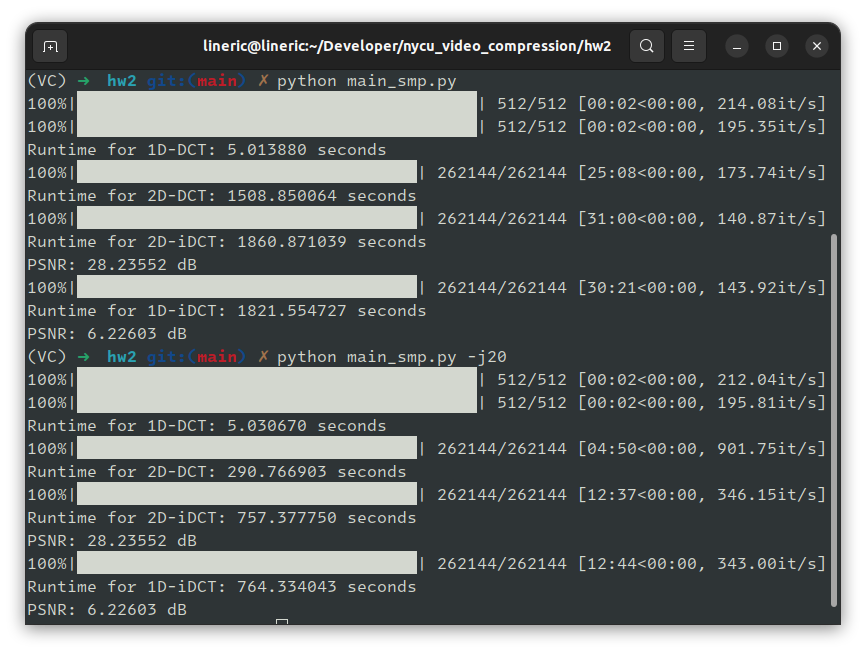

# HW2

origin:  

gray:  

## 2D-DCT

2D-DCT:  

using imshow():  

using imwrite():  

2D-iDCT reconstruct image:  

## 1D-DCT

two 1D-DCT:  

using imshow():  

using imwrite():  

## Compare

2D-DCT time: 1508 sec  
2D-iDCT time: 1860 sec  
2D-iDCT PSNR: 28.23552  

1D-DCT time: 5s  

