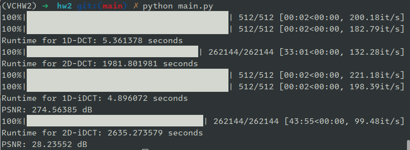

# HW 2

## Environment Setup

```pip install -r requirements.txt```

## Running

I using the multiprocessing to speed up the process, if you don't wannt to use multiprocessing, you can run

```python main.py```

it will use the default -j1

if you want to speed up the process, you can type this with full CPU thread

```python main.py -j$(nproc)```

or you can choose many CPU thread you want to use in your computer by ```-j{num}```, for example:

```python main.py -j4```

## Result

origin:  


gray:  


## 2D-DCT

2D-DCT:  


2D-iDCT reconstruct image:  


## 1D-DCT

two 1D-DCT:  


two 1D-iDCT reconstruct image:


## Compare

2D-DCT time: 1981 sec  
2D-iDCT time: 2635 sec  
2D-iDCT PSNR: 28.23552  

1D-DCT time: 5sec  
1D-iDCT time: 5sec  
1D-iDCT PSNR: 274.56385

