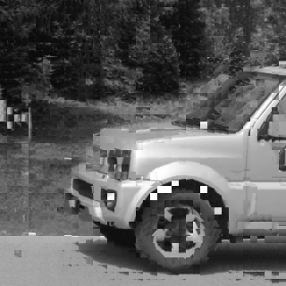
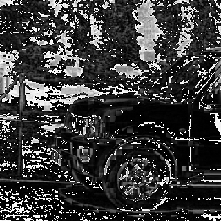
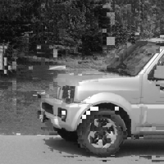
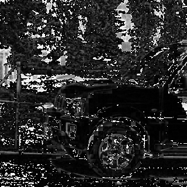
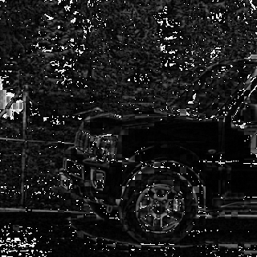
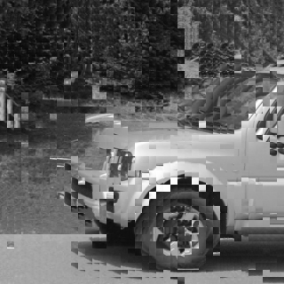
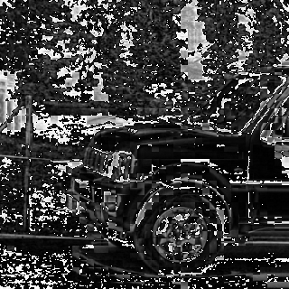

# HW3

## Setup

```pip install -r requirements.txt```

## Run

```python main.py```

## Result

origin: 

 

reconstruct:

search range 8:

 

search range 16:

 

search range 32:

 

three step search:

 